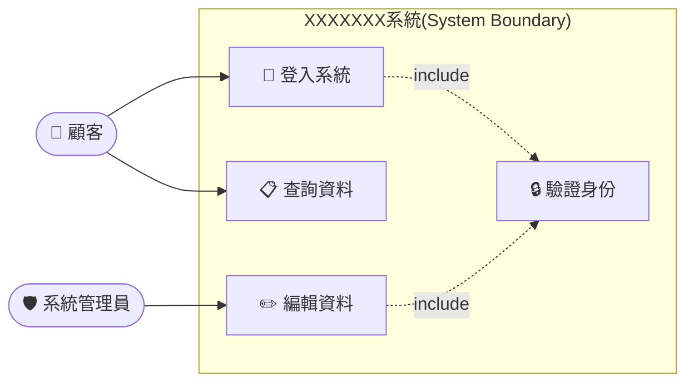

# Create Use Case Modeling

## 用途

依照業務流程，以 Mermaid 語法自動產生符合 UML 規範的 Use Case Diagram。

## 規則

1. **語法包裹**：所有 Mermaid 圖形必須以 ` ```mermaid ` 與 ` ``` ` 語法包裹，才能在 VSCode 中正確顯示。

2. **方向設定**：使用 `flowchart LR`（由左至右）呈現 Use Case Diagram。

3. **命名標註**：圖形中需清楚標註 Actor 與 Use Case 的名稱。

4. **UML 規範**：遵循 OMG UML 規範。當業務關係為【包含】時，必須明確標示 `include`。

5. **include 標示方式**：Mermaid 中的 include 關係使用 `-.->` 箭頭，並在箭頭上標註 `"|include|"` 文字，範例：
   ```
   UC_A -.-> |include| UC_B
   ```

6. **系統邊界**：subgraph 的名稱格式為：
   ```
   subgraph SYSTEM_NAME ["XXXXXXX系統(System Boundary)"]
   ```

7. **ICON 美化**：允許在 Use Case 節點名稱中使用特殊字元（如 Emoji）來美化顯示，例如：`UC1["🔑 登入系統"]`。

8. **Use Case 說明**：在圖形下方加入 `## Use Case 說明` 區塊，以表格或條列方式逐一描述每個 Use Case 的名稱、Actor 及功能說明。

## 範本

以下為完整輸出格式範例，可依業務需求調整：

````markdown

````

## Use Case 說明

| Use Case | Actor | 說明 |
|----------|-------|------|
| 🔑 登入系統 | 顧客 | 使用者輸入帳號密碼進行身份驗證以登入系統 |
| 📋 查詢資料 | 顧客 | 已登入的顧客可查詢相關資料 |
| ✏️ 編輯資料 | 系統管理員 | 管理員可新增、修改或刪除系統資料 |
| 🔒 驗證身份 | — | 由登入與編輯功能 include，負責核驗使用者憑證 |

## 執行步驟

1. 詢問或分析使用者提供的業務流程描述。
2. 識別所有 **Actor**（外部使用者、系統、角色）。
3. 識別所有 **Use Case**（系統提供的功能）。
4. 找出 Actor 與 Use Case 之間的關聯（association）。
5. 找出 Use Case 之間的 include / extend 關係。
6. 依上述規則產生 Mermaid 圖形（以 flowchart LR）。
7. 在圖形下方輸出 `## Use Case 說明` 表格。
