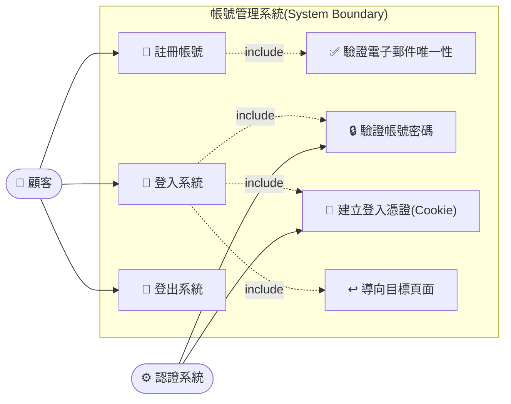

# Use Case Diagram：用戶登入流程

## Use Case 說明

| Use Case | Actor | 說明 |
|----------|-------|------|
| 📝 註冊帳號 | 顧客 | 顧客填寫姓名、Email 及密碼完成帳號建立；密碼以 PasswordHasher 雜湊後儲存 |
| 🔑 登入系統 | 顧客 | 顧客輸入 Email 與密碼，系統驗證後建立 Cookie 完成登入 |
| 🚪 登出系統 | 顧客 | 顧客點擊登出，系統清除 Cookie 認證並導回登入頁 |
| ✅ 驗證電子郵件唯一性 | 認證系統 | 由【註冊帳號】include，檢查 Email 是否已被其他帳號使用 |
| 🔒 驗證帳號密碼 | 認證系統 | 由【登入系統】include，以 PasswordHasher 比對輸入密碼與資料庫雜湊值 |
| 🎫 建立登入憑證(Cookie) | 認證系統 | 由【登入系統】include，將 CustomerId、FullName、Email 寫入 ClaimsPrincipal 並簽發 Cookie |
| ↩️ 導向目標頁面 | 認證系統 | 由【登入系統】include，登入成功後導向 ReturnUrl（若有且為本地路徑）或預設首頁 |
